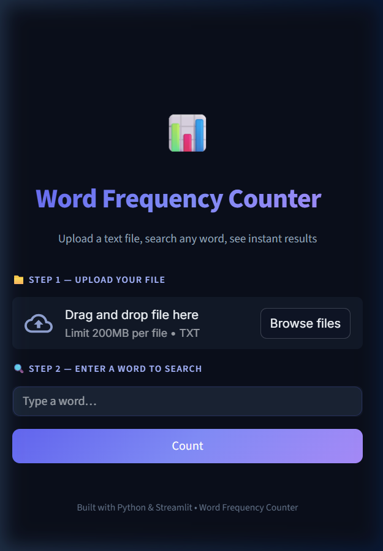
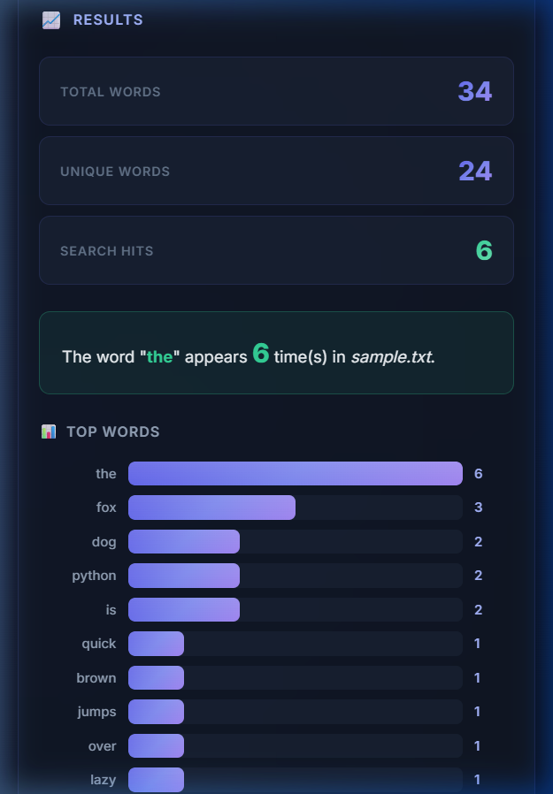
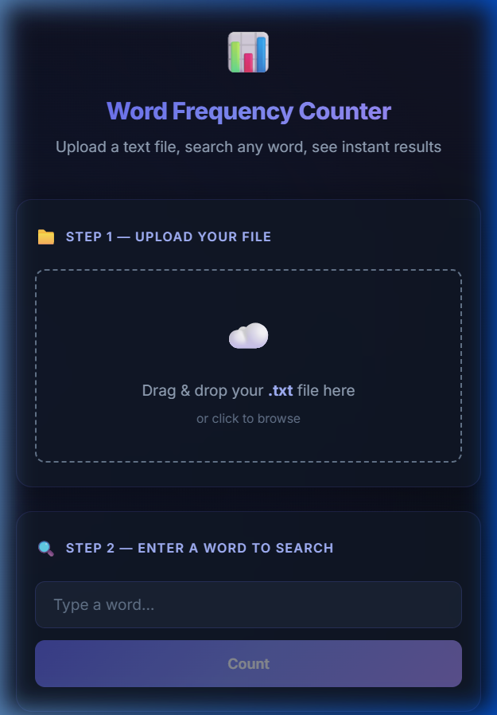

# 📊 Word Frequency Counter

A sleek, modern web app that counts word frequencies in text files. Upload a `.txt` file, search for any word, and instantly see how many times it appears — along with a visual chart of the top 15 most frequent words.


## 🌐 Live Demo

🔗 **[Try it online](https://word-frequency-counter-by-project24.streamlit.app)**


## 📸 Screenshots

### Landing Page
<p align="center">
  
</p>

### Results — Word Count & Top Words Chart
<p align="center">
  
</p>

### Mobile Responsive
<p align="center">
  
</p>

## ✨ Features

- 📁 **Drag & Drop** file upload (`.txt` files)
- 🔍 **Word Search** — case-insensitive, punctuation-stripped
- 📈 **Instant Stats** — total words, unique words, search hits
- 📊 **Top 15 Bar Chart** — visual frequency breakdown
- 🌙 **Premium Dark Theme** — glassmorphism-inspired design
- 📱 **Responsive** — works on desktop & mobile

## 🚀 Quick Start

### Prerequisites
- Python 3.8+

### Install & Run

```bash
# Clone the repo
git clone https://github.com/PRASH2005-project24/word-frequency-counter.git
cd word-frequency-counter

# Install dependencies
pip install -r requirements.txt

# Run the app
python -m streamlit run streamlit_app.py
```

Opens at `http://localhost:8501`

## 🛠️ Tech Stack

| Technology | Purpose |
|------------|---------|
| **Python** | Core language |
| **Streamlit** | Web framework & UI |
| **collections.Counter** | Word frequency analysis |
| **re** | Text cleaning & normalization |

## 📖 How It Works

1. **Upload** a `.txt` file via drag & drop or file browser
2. **Enter** a word you want to search for
3. **Click "Count"** to analyze
4. **View results**: word count, unique words, search hits, and a top-words bar chart

## 🌐 Deploy to Streamlit Cloud

1. Push this repo to GitHub
2. Go to [share.streamlit.io](https://share.streamlit.io)
3. Connect your GitHub repo
4. Set main file path to `streamlit_app.py`
5. Click **Deploy** 🚀

## 📁 Project Structure
```
word-frequency-counter/
├── streamlit_app.py        # Main Streamlit app
├── requirements.txt        # Dependencies
├── .streamlit/config.toml  # Dark theme config
├── screenshots/            # App screenshots
│   ├── landing_page.png
│   ├── results_page.png
│   └── mobile_view.png
├── .gitignore
└── README.md
```

## 📄 License

This project is open source under the [MIT License](LICENSE).

---

<p align="center">Built with ❤️ by <a href="https://github.com/PRASH2005-project24">Prashik Chandrasheel</a></p>
